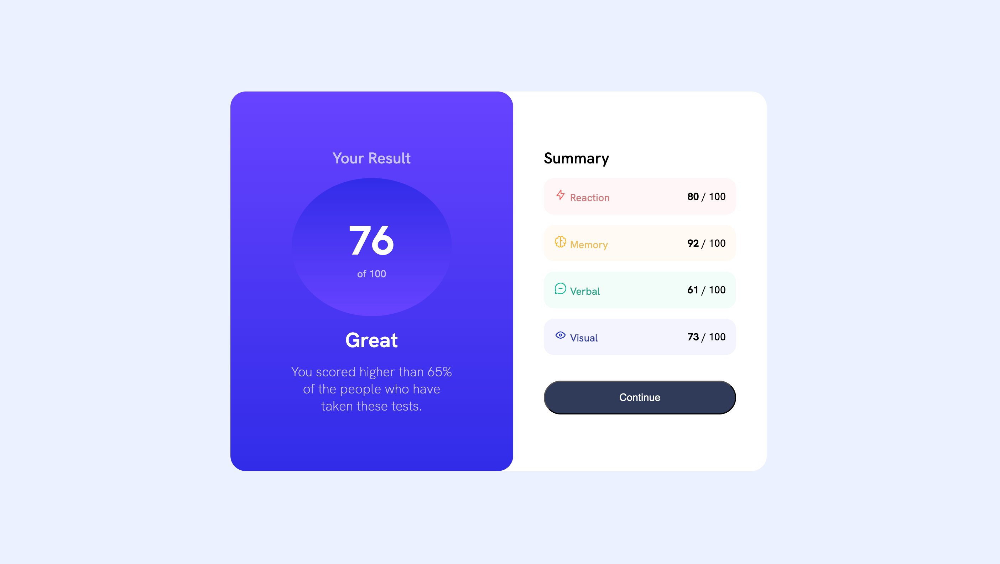

# Frontend Mentors: Results Summary Component Assignment
## Overview
This project attempts to recreate the design shown in Frontend Mentor's challenge, [Results Summary Component](https://www.frontendmentor.io/challenges/results-summary-component-CE_K6s0maV).  The design includes gradients, different states that need to be considered, and different layouts for web and mobile.  I have attempted to reproduce the results to the best of my current abilities.
## Tools Used
* HTML
* CSS
## Lessons Learned
This was the most complex design that I have worked on yet, and it allowed me to continue to hone my abilities with Flexbox.  Perhaps the most important lessons that I learned from this exercise was how to use the browser's development tools more effectively, tweaking aspects of the layout and design in the browser before setting the values in the CSS file.

## Challenges
Since the layout of the component has many different parts in different colours, it was challenging getting the design to look right.  There are still some elements that I may continue to tweak with this design, as I know that some of the text sizing is still a little bit off.

## Finished Assignment
The finished assignment can be viewed [here](https://grimmaldi.github.io/fe-mentors-results-summary-component-assignment/).  If you simply wish to see the final result without exiting this page, here is a screenshot of the assignment:
